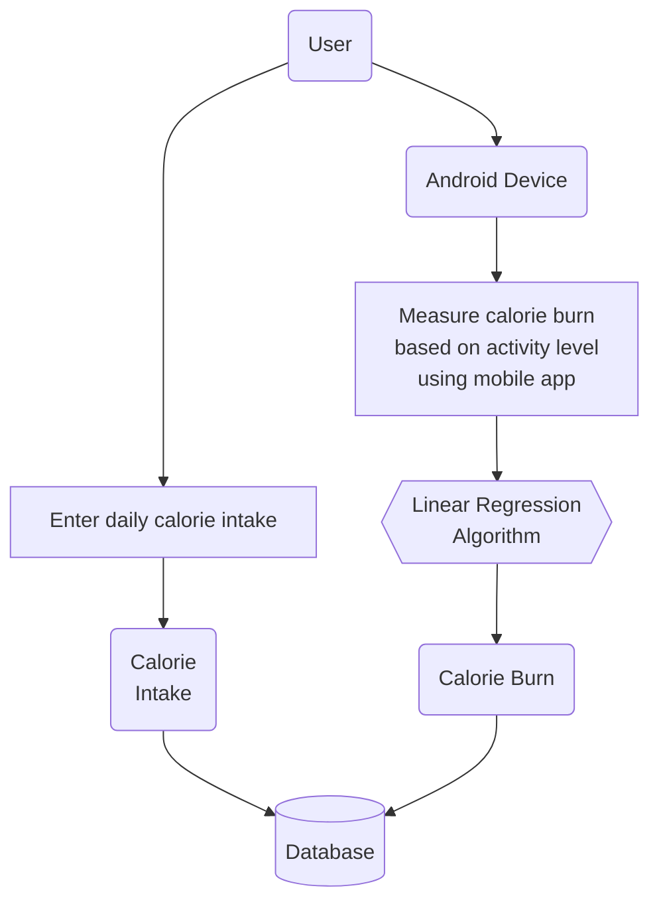

# Calorify

A Smart Calorie Burn Analyzer Using Linear Regression Algorithm

## System Flow Chart of Proposed Methodology

## Technologies Stack

1. [Flutter](https://flutter.dev/) for mobile development
2. [SQLite](https://www.sqlite.org/index.html) for data persistence
